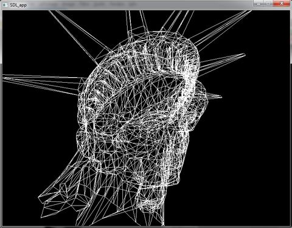
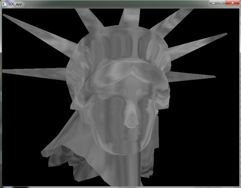

# ase file loader (and renderer)
Some old source code to render ASE (ASCII Scene Export) meshes (using OpenGL, SDL, also code is thus compilable and runnable under a GNU/linux or Windows target)
The ASE format is used through 3DStudioMax to export meshes through ASCII files.

The source code is released as a tutorial and is of course highly questionable. Nevertheless, it is not meant to evolve.

To go further: http://wiki.beyondunreal.com/Legacy:ASE_File_Format